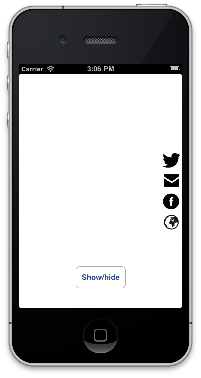

HMSideMenu
===

HMSideMenu allows you to display a menu of items that show from the side of a view controller with a delightful animation. Currently works on the right side only, but left, top and bottom are coming soon.

[](http://www.youtube.com/watch?v=2dswvXSdDzM)

Check [this video](http://www.youtube.com/watch?v=2dswvXSdDzM) to see how exactly it works.

# Features
- Menu items are UIView subclasses, so they are fully customizable.
- Supports blocks
- Works with ARC and iOS >= 5

# Installation

- Drag HMSideMenu folder to your project.
- Add `QuartzCore.framework` to your linked frameworks.
- `#import "HMSideMenu.h"` where you want to add the control.

# Usage

```  objective-c
HMSideMenuItem *twitterItem = [[HMSideMenuItem alloc] initWithSize:CGSizeMake(40, 40) action:^{
    NSLog(@"tapped twitter item");
}];

UIImageView *twitterIcon = [[UIImageView alloc] initWithFrame:CGRectMake(0, 0, 40, 40)];
[twitterIcon setImage:[UIImage imageNamed:@"twitter"]];
[twitterItem addSubview:twitterIcon];

HMSideMenu *sideMenu = [[HMSideMenu alloc] initWithItems:@[twitterItem]];
[self.sideMenu setVerticalSpacing:1.0f];
[self.view addSubview:self.sideMenu];
```

Please check the included demo project for more options.


# Change log
* v1.0.0
	* Initial release
	
# To do
* Ability to change menu position to either left, right, top or bottom.

# License

HMSideMenu is licensed under the terms of the MIT License. Please see the [LICENSE](LICENSE.md) file for full details.

If this code was helpful, I would love to hear from you.

[@HeshamMegid](http://twitter.com/HeshamMegid)   
[http://hesh.am](http://hesh.am)